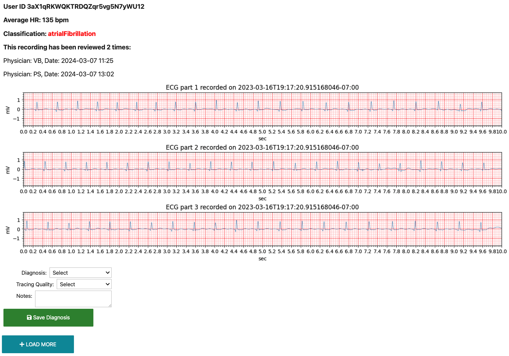

<!--

This source file is part of the Pediatric Apple Watch Study Application based on the Stanford Spezi Template Application project

SPDX-FileCopyrightText: 2024 Stanford University

SPDX-License-Identifier: MIT

-->

# Spezi ECG Data Pipeline

[](https://colab.research.google.com/github/[YourGitHub]/SpeziECGDataAnalysisPipeline/blob/main/SpeziECGDataInteractiveTool.ipynbhttps://colab.research.google.com/github/StanfordBDHG/PediatricAppleWatchStudy/blob/main/ECGDataPipelineTemplate/ECGDataPipelineTemplate.ipynb)
<!-- [](https://github.com/[YourGitHub]/SpeziECGDataAnalysisPipeline/actions/workflows/main.yml)
[](https://codecov.io/gh/[YourGitHub]/SpeziECGDataInteractiveTool.)
[](https://doi.org/10.5281/zenodo.0000000) -->


This folder contains the Spezi ECG Data Pipeline, a toolset for processing and analyzing ECG data. 

## Pipeline Structure

The Spezi ECG Data Pipeline adopts a modular structure, comprising several Python modules and a notebook for interactive data visualization and analysis:

- `firebase_access.py`: Manages access to Firebase for data storage and retrieval.
- `data_preparation.py`: Prepares and processes raw ECG data.
- `utils.py`: Provides utility functions for data processing.
- `visualization.py`: Contains functions for data visualization.
- `SpeziECGDataIteractECGDataPipelineTemplateiveTool.ipynb`: An interactive notebook for analyzing and reviewing ECG data.

## Run the Notebook in Google Colab

You can open and run the `ECGDataPipelineTemplate.ipynb` notebook in Google Colab by clicking the "Open In Colab" badge above.

### Setup Instructions in Colab

Once the notebook is open in Colab, execute the following cell to clone the Spezi ECG Data Analysis Pipeline repository and navigate into the cloned directory:

```python
# Cell 1: Clone GitHub repository for Spezi ECG Data Pipeline
!git clone https://github.com/StanfordBDHG/PediatricAppleWatchStudy.git
%cd PediatricAppleWatchStudy/ECGDataPipeline
```

Remember to upload the `serviceAccountKey_file.json` to the Colab workspace directory to enable Firebase access. This file is necessary for authentication and should be securely handled.

### Use the Interactive ECG Reviewing Tool

To start reviewing ECG data, execute the following cells in your notebook:

```python
# Cell 2: Import modules
from Modules.firebase_access import *
from Modules.data_preparation import *
from Modules.visualization import *
from Modules.utils import *
import os

# Cell 3: Define the path to your service account key file 
serviceAccountKey_file = 'path/to/serviceAccountKey.json'

# Cell 4: Connect to Firebase and download data
db = connect_to_firebase(serviceAccountKey_file)
ecg_data = process_data(db)

# Cell 5: Initialize the ECG Data Viewer and start reviewing
viewer = ECGDataViewer(ecg_data, db)
```

This interactive tool allows you to plot ECG data, add diagnoses, evaluate the trace quality, and add notes.



## Contributing

Contributions to this project are welcome. Please make sure to read the [contribution guidelines](https://github.com/StanfordSpezi/.github/blob/main/CONTRIBUTING.md) and the [contributor covenant code of conduct](https://github.com/StanfordSpezi/.github/blob/main/CODE_OF_CONDUCT.md) first.

## License

This project is licensed under the MIT License. See [Licenses](https://github.com/StanfordBDHG/PediatricAppleWatchStudy/tree/main/LICENSES) for more information.

## Our Research

For more information about our research and other projects, visit our website at [biodesigndigitalhealth.stanford.edu](https://biodesigndigitalhealth.stanford.edu/).


