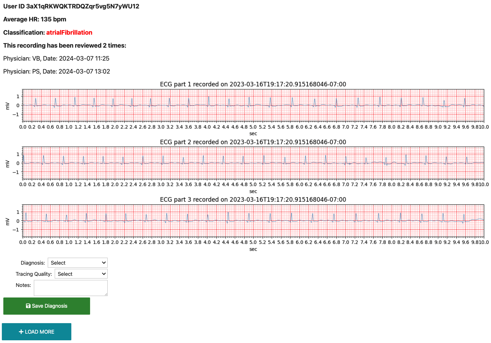
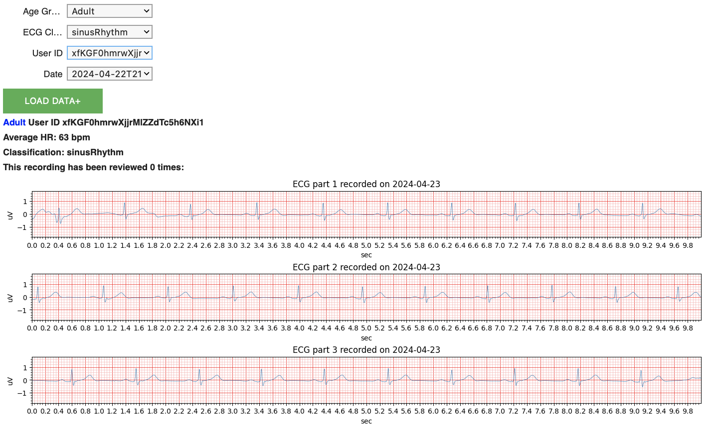

<!--

This source file is part of the Pediatric Apple Watch Study Application based on the Stanford Spezi Template Application project

SPDX-FileCopyrightText: 2023 Stanford University

SPDX-License-Identifier: MIT

-->

# Pediatric Apple Watch Study Application

[](https://github.com/StanfordBDHG/PediatricAppleWatchStudy/actions/workflows/beta-deployment.yml)
[](https://codecov.io/gh/StanfordBDHG/PediatricAppleWatchStudy)
[](https://doi.org/10.5281/zenodo.10602852)


This repository contains the Pediatric Apple Watch Study Application application.
The Pediatric Apple Watch Study Application is using the [Spezi](https://github.com/StanfordSpezi/Spezi) ecosystem and builds on top of the [Stanford Spezi Template Application](https://github.com/StanfordSpezi/SpeziTemplateApplication).


## Application Structure

The Spezi Template Application uses a modularized structure using the [Spezi modules](https://swiftpackageindex.com/StanfordSpezi) enabled by the Swift Package Manager.

The application uses the FHIR standard to provide a shared standard to encode data exchanged between different modules.

> [!NOTE]  
> Do you want to learn more about the Stanford Spezi Template Application and how to use, extend, and modify this application? Check out the [Stanford Spezi Template Application documentation](https://stanfordspezi.github.io/SpeziTemplateApplication)


## Build and Run the Application

You can build and run the application using [Xcode](https://developer.apple.com/xcode/) by opening up the **PAWS.xcodeproj**.

## Generate Invitation Codes

When signing in to the application for the first time, you will be required to enter a valid invitation code before a user account is created.
Use the `upload_codes.py` script to generate new codes and upload them to a specified Firebase instance or a local file.

```bash
export FIRESTORE_EMULATOR_HOST="localhost:8080"
export GCLOUD_PROJECT=<project_id>

python -m scripts.upload_codes --outfile=<local_path> \
--count=<number_of_codes> --length=<code_length> \
--service_account=<service_account_key_file> [--dry]
```

## Generate Screenshots
PAWS uses [Fastlane Snapshots](https://docs.fastlane.tools/getting-started/ios/screenshots/) to automatically screenshot specific screens in the app during UI tests.
To generate new screenshots, you will likewise need to set the proper environment variables for you shell session.

```bash
export FIRESTORE_EMULATOR_HOST="localhost:8080"
export GCLOUD_PROJECT=<project_id>

firebase emulators:start --import=./firebase
```

Then, run `fastlane snapshot`.
By default, results will end up in the `.screenshots` folder, overwriting previous files.

> [!NOTE]
> Snapshot will run UI tests and concurrently take screenshots on multiple device simulators.
> As such, multiple new PAWS accounts will be created, possibly in rapid succession, using the same hard-coded testing invitation codes.

The current workaround for simultaneous account registrations during `fastlane snapshot` is to continually reset invitation codes to an unused state in Firestore by running a designated Python script on repeat (in a shell session with the same environment variables).

```bash
for i in {1..360}; do python -m scripts.upload_codes; sleep 10; done
```

## ECG Data Manager

The ECG Data Manager provides capabilities for reviewing and exploring the recorded ECG data. It relies on the [spezi_data_pipeline](https://test.pypi.org/project/spezi-data-pipeline/0.1.0b1/) package which is a library engineered to improve workflows associated with data accessibility and analysis in healthcare environments. In addition, to the functions and classes of the spezi_data_pipeline, the two notebooks, namely `ECGReviewer.ipynb` and `ECGExplore.ipynb` offer an environment for interactive data visualization and analysis.

The ECG Data Manager includes:
- `utils.py`: Provides utility functions for data processing.
- `visualization.py`: Contains functions for data visualization.
- `ECGReviewer.ipynb`: An interactive notebook for loading, analyzing, and reviewing ECG data.
- `ECGExplorer.ipynb`: An interactive notebook for loading, exploring, and filtering ECG data based on filters, such as age group, ECG recording classification, user, and date.

### Notebook Setup Instructions

You can open and run the `ECGReviewer.ipynb` and `ECGExplorer.ipynb` notebooks in, e.g., Google Colab.
Once the notebook is open, execute the following cell to clone the PediatricAppleWatchStudy repository and navigate into the cloned directory:

```python
# Clone GitHub repository for Spezi ECG Data Pipeline
git clone https://github.com/StanfordBDHG/PediatricAppleWatchStudy.git
cd PediatricAppleWatchStudy/ecg_data_manager
```

Remember to upload the `serviceAccountKey_file.json` to the workspace directory to enable Firebase access. This file is necessary for authentication and should be securely handled.

### Use the Interactive ECG Reviewing Tool

To start reviewing ECG data, execute the cells in your notebook. 

This interactive tool allows you to plot ECG data, add diagnoses, evaluate the trace quality, and add notes.



### Use the Interactive ECG Exploring Tool

To start exploring ECG data, execute the cells in your notebook. 

This interactive tool allows you to plot ECG data, filter ECG recordings, and select specific users and timestamps.




## Contributing

Contributions to this project are welcome. Please make sure to read the [contribution guidelines](https://github.com/StanfordBDHG/.github/blob/main/CONTRIBUTING.md) and the [contributor covenant code of conduct](https://github.com/StanfordBDHG/.github/blob/main/CODE_OF_CONDUCT.md) first.


## License

This project is licensed under the MIT License. See [Licenses](https://github.com/StanfordBDHG/PediatricAppleWatchStudy/tree/main/LICENSES) for more information.


## Our Research

For more information, check out our website at [biodesigndigitalhealth.stanford.edu](https://biodesigndigitalhealth.stanford.edu).


